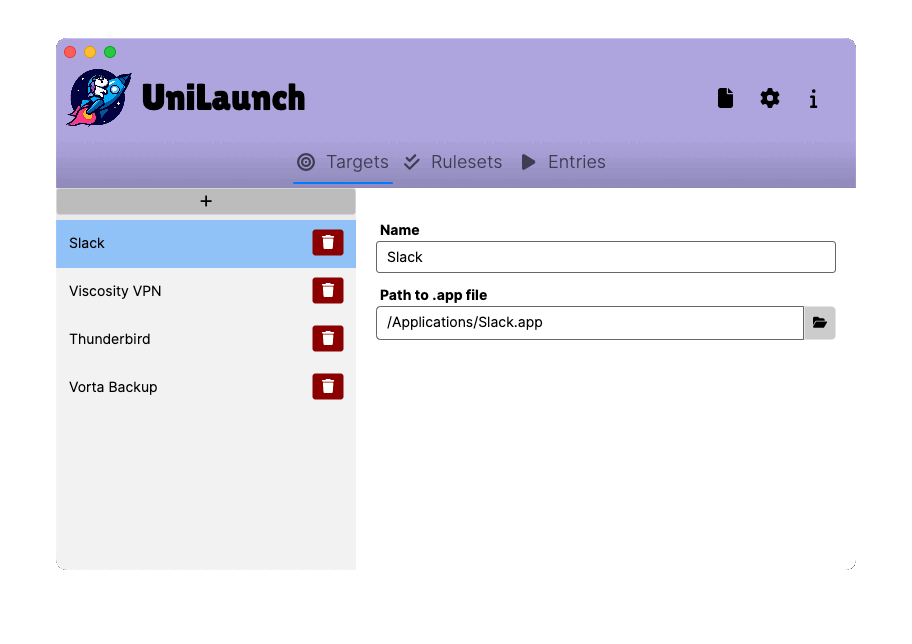
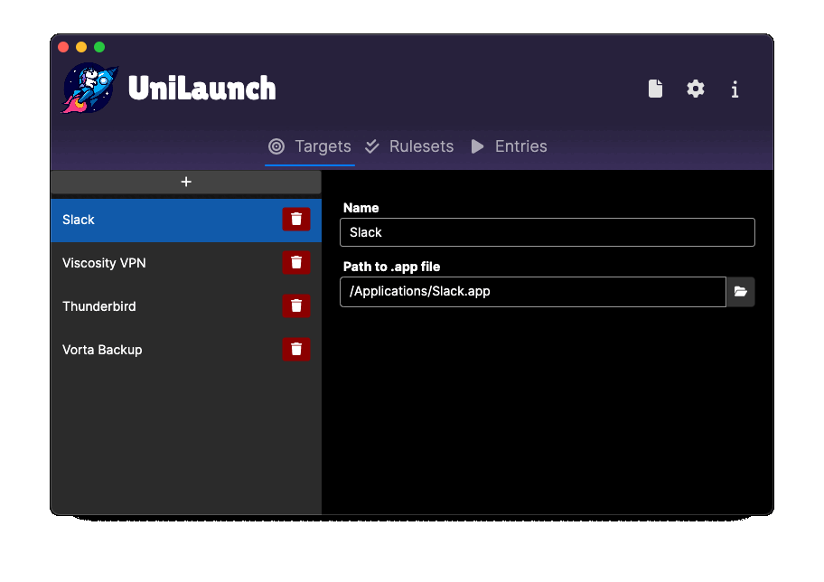

UniLaunch
===
[](https://github.com/timo-reymann/UniLaunch/blob/main/LICENSE)
[](https://app.circleci.com/pipelines/github/timo-reymann/UniLaunch)
[](https://github.com/timo-reymann/UniLaunch/releases)
[](https://github.com/timo-reymann/UniLaunch/releases)
[![Renovate](https://img.shields.io/badge/renovate-enabled-green?logo=data:image/svg+xml;base64,PHN2ZyB4bWxucz0iaHR0cDovL3d3dy53My5vcmcvMjAwMC9zdmciIHZpZXdCb3g9IjAgMCAzNjkgMzY5Ij48Y2lyY2xlIGN4PSIxODkuOSIgY3k9IjE5MC4yIiByPSIxODQuNSIgZmlsbD0iI2ZmZTQyZSIgdHJhbnNmb3JtPSJ0cmFuc2xhdGUoLTUgLTYpIi8+PHBhdGggZmlsbD0iIzhiYjViNSIgZD0iTTI1MSAyNTZsLTM4LTM4YTE3IDE3IDAgMDEwLTI0bDU2LTU2YzItMiAyLTYgMC03bC0yMC0yMWE1IDUgMCAwMC03IDBsLTEzIDEyLTktOCAxMy0xM2ExNyAxNyAwIDAxMjQgMGwyMSAyMWM3IDcgNyAxNyAwIDI0bC01NiA1N2E1IDUgMCAwMDAgN2wzOCAzOHoiLz48cGF0aCBmaWxsPSIjZDk1NjEyIiBkPSJNMzAwIDI4OGwtOCA4Yy00IDQtMTEgNC0xNiAwbC00Ni00NmMtNS01LTUtMTIgMC0xNmw4LThjNC00IDExLTQgMTUgMGw0NyA0N2M0IDQgNCAxMSAwIDE1eiIvPjxwYXRoIGZpbGw9IiMyNGJmYmUiIGQ9Ik04MSAxODVsMTgtMTggMTggMTgtMTggMTh6Ii8+PHBhdGggZmlsbD0iIzI1YzRjMyIgZD0iTTIyMCAxMDBsMjMgMjNjNCA0IDQgMTEgMCAxNkwxNDIgMjQwYy00IDQtMTEgNC0xNSAwbC0yNC0yNGMtNC00LTQtMTEgMC0xNWwxMDEtMTAxYzUtNSAxMi01IDE2IDB6Ii8+PHBhdGggZmlsbD0iIzFkZGVkZCIgZD0iTTk5IDE2N2wxOC0xOCAxOCAxOC0xOCAxOHoiLz48cGF0aCBmaWxsPSIjMDBhZmIzIiBkPSJNMjMwIDExMGwxMyAxM2M0IDQgNCAxMSAwIDE2TDE0MiAyNDBjLTQgNC0xMSA0LTE1IDBsLTEzLTEzYzQgNCAxMSA0IDE1IDBsMTAxLTEwMWM1LTUgNS0xMSAwLTE2eiIvPjxwYXRoIGZpbGw9IiMyNGJmYmUiIGQ9Ik0xMTYgMTQ5bDE4LTE4IDE4IDE4LTE4IDE4eiIvPjxwYXRoIGZpbGw9IiMxZGRlZGQiIGQ9Ik0xMzQgMTMxbDE4LTE4IDE4IDE4LTE4IDE4eiIvPjxwYXRoIGZpbGw9IiMxYmNmY2UiIGQ9Ik0xNTIgMTEzbDE4LTE4IDE4IDE4LTE4IDE4eiIvPjxwYXRoIGZpbGw9IiMyNGJmYmUiIGQ9Ik0xNzAgOTVsMTgtMTggMTggMTgtMTggMTh6Ii8+PHBhdGggZmlsbD0iIzFiY2ZjZSIgZD0iTTYzIDE2N2wxOC0xOCAxOCAxOC0xOCAxOHpNOTggMTMxbDE4LTE4IDE4IDE4LTE4IDE4eiIvPjxwYXRoIGZpbGw9IiMzNGVkZWIiIGQ9Ik0xMzQgOTVsMTgtMTggMTggMTgtMTggMTh6Ii8+PHBhdGggZmlsbD0iIzFiY2ZjZSIgZD0iTTE1MyA3OGwxOC0xOCAxOCAxOC0xOCAxOHoiLz48cGF0aCBmaWxsPSIjMzRlZGViIiBkPSJNODAgMTEzbDE4LTE3IDE4IDE3LTE4IDE4ek0xMzUgNjBsMTgtMTggMTggMTgtMTggMTh6Ii8+PHBhdGggZmlsbD0iIzk4ZWRlYiIgZD0iTTI3IDEzMWwxOC0xOCAxOCAxOC0xOCAxOHoiLz48cGF0aCBmaWxsPSIjYjUzZTAyIiBkPSJNMjg1IDI1OGw3IDdjNCA0IDQgMTEgMCAxNWwtOCA4Yy00IDQtMTEgNC0xNiAwbC02LTdjNCA1IDExIDUgMTUgMGw4LTdjNC01IDQtMTIgMC0xNnoiLz48cGF0aCBmaWxsPSIjOThlZGViIiBkPSJNODEgNzhsMTgtMTggMTggMTgtMTggMTh6Ii8+PHBhdGggZmlsbD0iIzAwYTNhMiIgZD0iTTIzNSAxMTVsOCA4YzQgNCA0IDExIDAgMTZMMTQyIDI0MGMtNCA0LTExIDQtMTUgMGwtOS05YzUgNSAxMiA1IDE2IDBsMTAxLTEwMWM0LTQgNC0xMSAwLTE1eiIvPjxwYXRoIGZpbGw9IiMzOWQ5ZDgiIGQ9Ik0yMjggMTA4bC04LThjLTQtNS0xMS01LTE2IDBMMTAzIDIwMWMtNCA0LTQgMTEgMCAxNWw4IDhjLTQtNC00LTExIDAtMTVsMTAxLTEwMWM1LTQgMTItNCAxNiAweiIvPjxwYXRoIGZpbGw9IiNhMzM5MDQiIGQ9Ik0yOTEgMjY0bDggOGM0IDQgNCAxMSAwIDE2bC04IDdjLTQgNS0xMSA1LTE1IDBsLTktOGM1IDUgMTIgNSAxNiAwbDgtOGM0LTQgNC0xMSAwLTE1eiIvPjxwYXRoIGZpbGw9IiNlYjZlMmQiIGQ9Ik0yNjAgMjMzbC00LTRjLTYtNi0xNy02LTIzIDAtNyA3LTcgMTcgMCAyNGw0IDRjLTQtNS00LTExIDAtMTZsOC04YzQtNCAxMS00IDE1IDB6Ii8+PHBhdGggZmlsbD0iIzEzYWNiZCIgZD0iTTEzNCAyNDhjLTQgMC04LTItMTEtNWwtMjMtMjNhMTYgMTYgMCAwMTAtMjNMMjAxIDk2YTE2IDE2IDAgMDEyMiAwbDI0IDI0YzYgNiA2IDE2IDAgMjJMMTQ2IDI0M2MtMyAzLTcgNS0xMiA1em03OC0xNDdsLTQgMi0xMDEgMTAxYTYgNiAwIDAwMCA5bDIzIDIzYTYgNiAwIDAwOSAwbDEwMS0xMDFhNiA2IDAgMDAwLTlsLTI0LTIzLTQtMnoiLz48cGF0aCBmaWxsPSIjYmY0NDA0IiBkPSJNMjg0IDMwNGMtNCAwLTgtMS0xMS00bC00Ny00N2MtNi02LTYtMTYgMC0yMmw4LThjNi02IDE2LTYgMjIgMGw0NyA0NmM2IDcgNiAxNyAwIDIzbC04IDhjLTMgMy03IDQtMTEgNHptLTM5LTc2Yy0xIDAtMyAwLTQgMmwtOCA3Yy0yIDMtMiA3IDAgOWw0NyA0N2E2IDYgMCAwMDkgMGw3LThjMy0yIDMtNiAwLTlsLTQ2LTQ2Yy0yLTItMy0yLTUtMnoiLz48L3N2Zz4=)](https://renovatebot.com)
[](https://sonarcloud.io/summary/new_code?id=timo-reymann_UniLaunch)
[](https://sonarcloud.io/summary/new_code?id=timo-reymann_UniLaunch)
[](https://sonarcloud.io/summary/new_code?id=timo-reymann_UniLaunch)

<p align="center">
	
    <br />
    Advanced universal autostart tool for use on Linux, MacOS and Windows.
</p>

## Features

- Support for all major platforms
- Multiple configuration file formats available
- Customizable autostart functionality
- Reusable rule sets
- dotfile-compatible configuration file location

### UI Sneak Peak

No matter which side you are on. Dark or light, I got you covered:

|  |  |
|:------------------------------------:|:-------------------------------------:|
|               **Dark**               |               **Light**               |

## Requirements

- Windows, MacOS or Linux

## Installation

For all installation methods please execute UniLaunch once to make sure it registers itself to the autostart.

I provide multiple installation options for each platform:

- [Windows](#installation-for-windows)
- [Debian-based distros](#installation-for-debian--ubuntu-based-linux-distro)
- [AppImage](#installation-using-appimage-for-generic-linux-platform)
- [Linux standalone binary](#installation-for-linux-as-standalone-binary)

### Installation for Windows

For most use cases I recommend downloading the installer, it will set up autostart for you automatically and installs
UniLaunch to your programs folder. Simply download and execute `UniLaunch-Setup.exe`
from [the latest GitHub Release](https://github.com/timo-reymann/UniLaunch/releases/latest).

If you want to use the standalone exe please download `UniLaunch-win-x64.exe` for any x64 system or in case you are
running Windows on ARM ` UniLaunch-win-amr64.exe`
from [the latest GitHub Release](https://github.com/timo-reymann/UniLaunch/releases/latest).

### Installation for macOS

If you have brew installed, installing UniLaunch is very easy:

```sh
brew tap timo-reymann/unilaunch https://github.com/timo-reymann/UniLaunch.git
brew install --cask --no-quarantine UniLaunch 
```

Otherwise you will have to download the file manually and allow it for Gatekeeper manually:

> The app file is not signed, as I dont want to spend money on a completely free app.
>
> Follow the guide from [Apple Docs](https://support.apple.com/en-EN/guide/mac-help/mh40616/mac) to allow the app as an
> exception
>
> If for some reason that does not work you can manually allow the app with the following command:
>
> ```sh
> sudo xattr -r -d com.apple.quarantine /Applications/UniLaunch.app
> ```
> Open iTerm.app and execute the command given. It will delete the quarantine attribute from your file, allowing it to
> launch.

If you have an M1/M2 chip please download the UniLaunch-Silicon.dmg installer, for Intel-based Mac UniLaunch-x64.dmg
from [the latest GitHub Release](https://github.com/timo-reymann/UniLaunch/releases/latest).

### Installation for Debian / Ubuntu-based Linux distro

Download the `UniLaunch-amd64.deb`
from [the latest GitHub Release](https://github.com/timo-reymann/UniLaunch/releases/latest).

Install it with dpkg:

````sh
dpkg -i UniLaunch-<arch>.deb
````

### Installation using AppImage for generic linux platform

If you prefer having a AppImage and use an x64 CPU, please download `UniLaunch-x64.AppImage`
from [the latest GitHub Release](https://github.com/timo-reymann/UniLaunch/releases/latest).

Move it to your applications folder and make it executable:

```sh
sudo mv UniLaunch-x64.AppImage /opt/UniLaunch/UniLaunch.AppImage
sudo chmod +x /opt/UniLaunch/UniLaunch.AppImage
```

### Installation for linux as standalone binary

Download the suitable x64 (UniLaunch-linux-x64) or ARM (UniLaunch-linux-arm64) binary
from [the latest GitHub Release](https://github.com/timo-reymann/UniLaunch/releases/latest).

Move it to the bin folder and make it executable:

```sh
mv UniLaunch-linux-<arch> /usr/local/bin/unilaunch
chmod +x /usr/local/bin/unilaunch
```

After installation execute UniLaunch once, this way it registers to the autostart of your OS automatically.

## Usage

### Concepts

#### Terminology

- **Rule**: Specifies a condition that should be fulfilled
- **Ruleset**: Combines multiple rules into a reusable set
- **Target**: Something to launch based on a ruleset, (e.g. an application, scripts)
- **Entry**: An autostart element. It consists of the name of the ruleset (when to execute) and the name of the target (
  what to execute)

#### Targets

Targets are defined by UniLaunch, the following target types are supported:

##### `appFile`

Start an `.app` file.

> This target type is only available for MacOS.

| Parameter                  | Value                                                     | Example                 |
|:---------------------------|:----------------------------------------------------------|:------------------------|
| Path                       | Absolute path to the .app file to launch                  | /Applications/Slack.app |
| WaitForNetworkConnectivity | Try to wait for network to be reachable to execute target | true                    |

##### `executable`

Launch any executable.

| Parameter                  | Value                                                     | Examples                                                    |
|:---------------------------|:----------------------------------------------------------|:------------------------------------------------------------|
| Path                       | Absolute path to the executable file to launch            | /usr/bin/test.exe, C:/Program Files/MyProgram/MyProgram.exe |
| Arguments                  | List of arguments to pass to the executable               | `[foo, bar]`                                                |
| WaitForNetworkConnectivity | Try to wait for network to be reachable to execute target | true                                                        |

#### Rules

Rules are defined by UniLaunch, the following are supported:

##### `time`

Execute if startup happens in the given time frame.

| Parameter  | Value                    | Example |
|:-----------|:-------------------------|:--------|
| StartRange | 24h time in format HH:mm | 13:15   |
| EndRange   | 24h time in format HH:mm | 20:00   |

##### `week-day`

Execute on all listed weekdays

| Parameter       | Value                                       | Example             |
|:----------------|:--------------------------------------------|:--------------------|
| DaysOfWeekToRun | List of names of the weekdays to execute on | `[Monday, Tuesday]` |

##### `always`

The always rule is just a simple trick to allow you to use UniLaunch to manage your regular startup or just quickly
verify it works with your applications.

In case you want to e.g. version autostart of applications using your dotfiles to not have to configure your OS when you
move around a lot between machines etc. this also comes quite handy.

#### How it works

On every start of UniLaunch the autostart entry is ensured to be
present. When you log-in the following process is triggered:

1. The configuration file is located and parsed
2. All entries are loaded
3. Resolve rules and targets
4. Drop unsupported rules and targets for the platform
5. Execute all targets in parallel
    1. Verify rule set matches all rules
    2. Start up target
6. Report start up results to stdout
7. Terminate the autostart mode of UniLaunch

You can also simulate this anytime with

```sh
{UniLaunchExecutable} --autostart
```

### Configuration

#### Visual

You can use the built in UI of UniLaunch to create your rules, rulesets and targets easily. Just start UniLaunch, and
start configuring.

#### Example configuration

##### YAML

YAML is the recommended file format, as it is easier to read and more compact than JSON.

```yaml
connectivityCheck:
  endpoint: https://connectivity.example.com
  timeout: 00:30
ruleSets:
  - name: Weekend
    rules:
      - ruleName: week-day
        daysOfWeekToRun:
          - Saturday
          - Sunday
      - ruleName: time
        startRange: 00:00
        endRange: 19:00
  - name: Workday
    rules:
      - ruleName: week-day
        daysOfWeekToRun:
          - Monday
          - Tuesday
          - Wednesday
          - Thursday
          - Friday
      - ruleName: time
        startRange: 07:30
        endRange: 17:30
targets:
  - targetType: appFile
    path: /Applications/Slack.app
    name: Slack
  - targetType: appFile
    path: /Applications/Thunderbird.app
    name: Thunderbird
entries:
  - ruleSetName: Workday
    targetName: Slack
  - ruleSetName: Workday
    targetName: Thunderbird
  - ruleSetName: Weekend
    targetName: Thunderbird
```

##### JSON

JSON is not recommended, but supported. See the example config below:

<details>
  <summary>Example JSON config</summary>

````json
{
  "connectivityCheck": {
    "endpoint": "https://connectivity.example.com",
    "timeout": "00:30"
  },
  "ruleSets": [
    {
      "name": "Weekend",
      "rules": [
        {
          "ruleName": "week-day",
          "daysOfWeekToRun": [
            "Saturday",
            "Sunday"
          ]
        },
        {
          "ruleName": "time",
          "startRange": "00:00",
          "endRange": 1140
        }
      ]
    },
    {
      "name": "Workday",
      "rules": [
        {
          "ruleName": "week-day",
          "daysOfWeekToRun": [
            "Monday",
            "Tuesday",
            "Wednesday",
            "Thursday",
            "Friday"
          ]
        },
        {
          "ruleName": "time",
          "startRange": "07:30",
          "endRange": 1050
        }
      ]
    }
  ],
  "targets": [
    {
      "targetType": "appFile",
      "path": "/Applications/Slack.app",
      "name": "Slack"
    },
    {
      "targetType": "appFile",
      "path": "/Applications/Thunderbird.app",
      "name": "Thunderbird"
    }
  ],
  "entries": [
    {
      "ruleSetName": "Workday",
      "targetName": "Slack"
    },
    {
      "ruleSetName": "Workday",
      "targetName": "Thunderbird"
    },
    {
      "ruleSetName": "Weekend",
      "targetName": "Thunderbird"
    }
  ]
}
````

</details>

#### Configuration file location

Depending on your platform there are different configuration locations searched.

UniLaunch checks sequentially down the list, once one file is found that is readable,
it tries to load and parse the given file. If an error occurs during read an runtime error is thrown and
the startup of applications does not succeed.

##### Windows

1. `%LOCALAPPDATA%`\UniLaunch\config.yml
2. `%LOCALAPPDATA%`\UniLaunch\config.json

##### Linux

1. `$XDG_CONFIG_HOME`/UniLaunch/config.yml
2. `$HOME`/.config/UniLaunch/config.yml
3. `$XDG_CONFIG_HOME`/UniLaunch/config.json
4. `$HOME`/.config/UniLaunch/config.json
5. /etc/default/UniLaunch

##### MaCOS

1. `$HOME`/Library/Application Support/UniLaunch/config.yml
2. `$HOME`/.config/uniLaunch.yml
3. `$HOME`/.config/uniLaunch.macos.yml
4. `$HOME`/Library/Application Support/UniLaunch/config.json
5. `$HOME`/.config/uniLaunch.json
6. `$HOME`/.config/uniLaunch.macos.json

## Motivation

I use my devices very differently based on the time I start or login to my machines. While for work I need other
programs than for a gaming or programming sessions. Starting these up every day in the same rhythm is annoying and costs
unnecessary time. This comes especially handy when you use a corporate device with an according policy also for private
use.

As I imagine other users have the same problem I decided to build this wonderful project as Open Source.

## Contributing

I love your input! I want to make contributing to this project as easy and transparent as possible, whether it's:

- Reporting a bug
- Discussing the current state of the configuration
- Submitting a fix
- Proposing new features
- Becoming a maintainer

To get started please read the [Contribution Guidelines](./CONTRIBUTING.md).

## Development

### Requirements

#### General

- [.NET Core SDK 8.x](https://dotnet.microsoft.com/en-us/download/dotnet/8.0)
- [make](https://www.gnu.org/software/make/)

#### Linux

- [Docker](https://docs.docker.com/get-started/)

#### Windows

- [InnoSetup](https://jrsoftware.org/isdl.php)

#### MacOS

- [create-dmg](https://github.com/create-dmg/create-dmg)

### Test

````sh
make test
````

### Build

To get the best experience, you should run the builds on each platform respectively.

```sh
make {linux|windows|macos}-build
```

### Alternatives

- Manual autostart and scripts for each platform (script-based; etc.)
